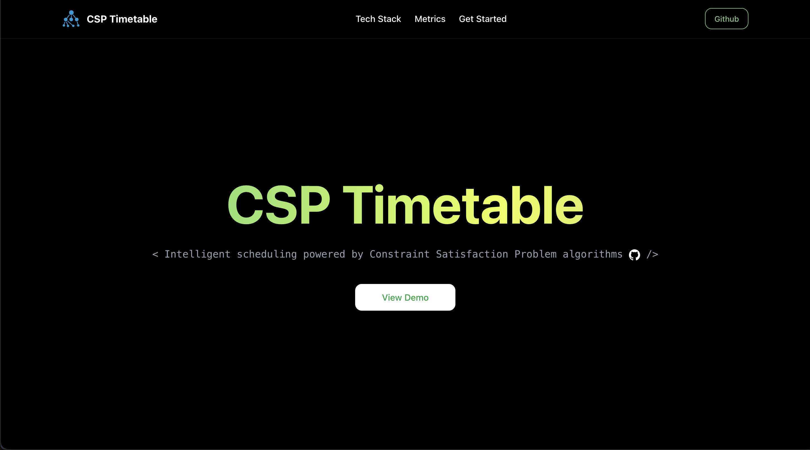
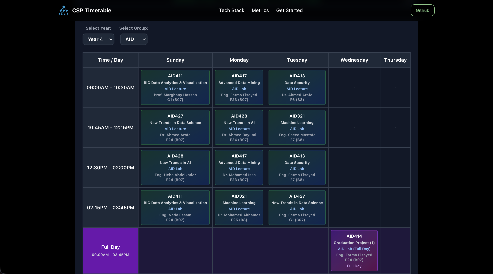

# Timetable Generation

An intelligent University Timetable Generation System developed for the Computer Science department at EJUST. This project utilizes Constraint Satisfaction Problems (CSP) to automatically generate conflict-free schedules, ensuring optimal resource allocation and zero hard-constraint violations.

Built with a high-performance C++ backend for the core solver and a modern React frontend for intuitive interaction.



## Requirements

- C++ Compiler (supporting C++17)
- CMake
- Node.js & npm

## Quick Start (Recommended)



Run both the backend server and the frontend client concurrently:

1. Navigate to the client directory:
   ```sh
   cd client
   ```
2. Install dependencies (first time only):
   ```sh
   npm install
   ```
3. Run the complete system:
   ```sh
   npm run dev:all
   ```

## Manual Build & Run

If you prefer to run components separately:

### Backend

1. Navigate to the project root.
2. Build the project:
   ```sh
   cmake -S . -B build
   cmake --build build
   ```
3. Run the solver:
   ```sh
   ./build/TestSql
   ```
4. Run the server:
   ```sh
   cd client
   npm run server
   ```

### Frontend

1. Navigate to the client directory:
   ```sh
   cd client
   ```
2. Install dependencies:
   ```sh
   npm install
   ```
3. Run the development server:
   ```sh
   npm run dev
   ```
