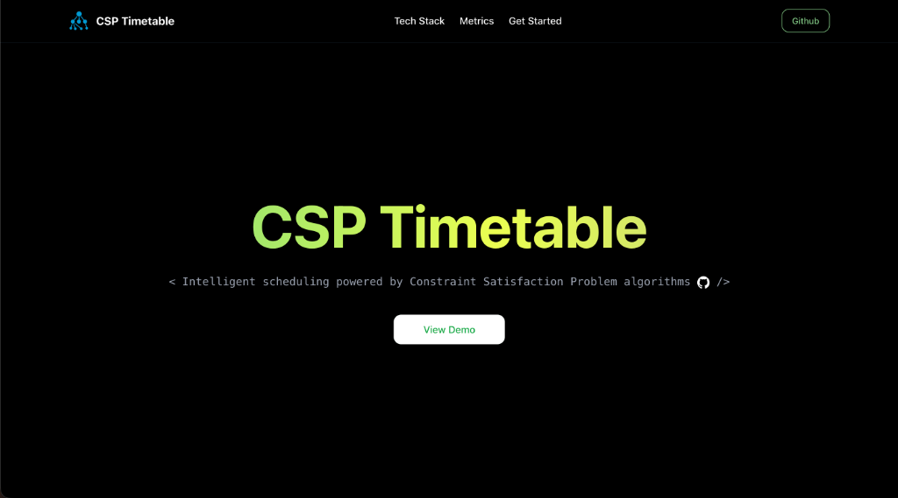
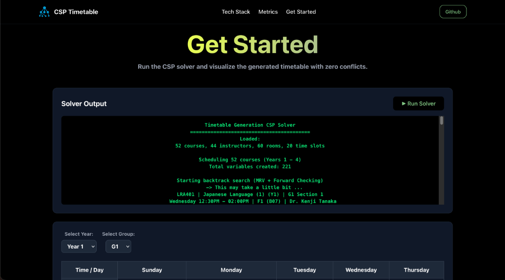

# Timetable Generation

A CSP-based timetable generator using C++ for the backend and React for the frontend.




## Requirements
- C++ Compiler (supporting C++17)
- CMake
- Node.js & npm

## Build & Run

### Backend
1. Navigate to the project root.
2. Build the project:
   ```sh
   cmake -S . -B build
   cmake --build build
   ```
3. Run the solver:
   ```sh
   ./build/TestSql
   ```

### Frontend
1. Navigate to the client directory:
   ```sh
   cd client
   ```
2. Install dependencies:
   ```sh
   npm install
   ```
3. Run the development server:
   ```sh
   npm run dev
   ```
